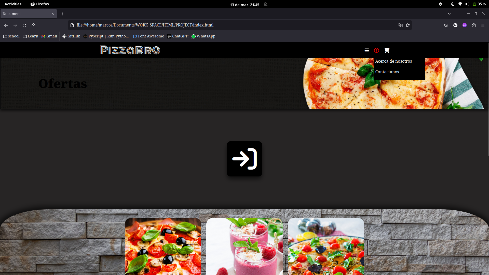

# Objetivo funcional de la web:

En el siguiente proyecto el objetivo perseguido es simular el comportamiento que tendría una página web de venta de pizzas,cuyo nombre es PizzaBro.
Contamos con un menú que contiene pizzas , bebidas y postres.
También  recogemos un apartado donde mostramos los días en que brindamos nuestros servicios.


Para poder suplir todas esas necesidades hemos implementado un *menú lateral ocultable* , mediante el cual podemos acceder a los *html* correspondientes a cada uno de los apartados.


Para poder conseguir dicho efecto con css hemos utilizado un checkbox y un label para poder simular el evento click, unido a las propiedades css adecuadas.

También queremos que nuestro cliente pueda loguearse en nuestra web, de esta forma podríamos enviarle promociones de nuestros productos.


En el footer de nuestra web mostramos contenido que pensamos que puede ser relevante para nuestro usuario como lo son: nuestra historia , como contactarnos y nuestra dirección.
Dicha información será de fácil acceso , ya que contamos con un menú desplegable donde podemos encontrar enlaces directos a nuestra info.




Como queremos que nuestro cliente conozca nuestras mejores ofertas contamos con un banner que tendrá un enlace directo a nuestras ofertas, donde haciendo uso de una galería de imágenes pequeñas sobre una más grande cuyo fondo es un muro de piedra , tratando de  asemejarse a un horno de piedra , forma tradicional de cocinar la pizzas, conseguimos un efecto moderno y limpio.


Me gustaría agregar que no he utilizado object-fit y en su lugar utilice las propiedades de background que básicamente son lo mismo, en vez de hacer uso de ```object- fit:cover``` he empleado ```background-size:cover``` , logrando el mismo efecto.

# Apartados:

Todos tienen un estilo similar , respetando el hecho de que son una carta donde puedes agregar pizzas al carrito o agregar a tu lista de compras favoritas.

## Pizzas


## Postres


## Bebidas


## Horario


# Consideraciones : 
Toda nuestra web es responsive , gracias al uso de la fuente en *em* , maquetación haciendo uso de *grid* y que hemos ordenado los elementos con *flex*
Hemos empleado media queries para poder suplir las necesidades de proporciones para los diferentes dispositivos.

